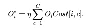
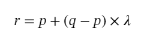

# Long-Tailed Learning

## Question Setting

* **Imbalanced Train Set and Balanced Test Set**

## Trends of Solutions
* **Data level techniques: SAMPLING**
	* **over-sampling**
		* disadvantages: overfitting to less samples
		* less followers
	* **down-sampling**
		* disadvantages: loss of information
		* less followers
	* **class-balanced sampling**
	  * combine over-sampling and down-sampling
	* **mixing minor samples**
	  * SMOTE: Synthetic Minority Over-sampling Technique
* **Loss level techniques: REWEIGHTING**
	* **loss level**: make minor classes' misclassification cost higher
		* ratio of total population to class population
	* **score level**: balance the predicting scores directly
		* Training Cost-Sensitive Neural Networks with Methods Addressing the Class Imbalance Problem
* **Others**
  * **Transfer based techniques**
  * **Clustering based techniques**

## Popular Benchmarks
* ImageNet-LT
* Places365-LT
* iNaturalist

## Related Papers
### Training Cost-Sensitive Neural Networks with Methods Addressing the Class Imbalance Problem
* 
* Cost based moving threshold can achieve similar performance with the sampling methods.
* Cost function should be pre-defined. 

### SMOTE: Synthetic Minority Over-sampling Technique

* 
* Generate synthetic examples from K-means neighbours by operating in “feature space”
* Combine over-sampling and down-sampling

## Take-on Message

* For sampling: The performance depends on the class DISCRIMINATORY INFORMATION contained in the PRUNED PORPULATION.
* SCORE LEVEL BALANCING is underdeveloped
* Balancing will hurt feature learning, while help classifier learning